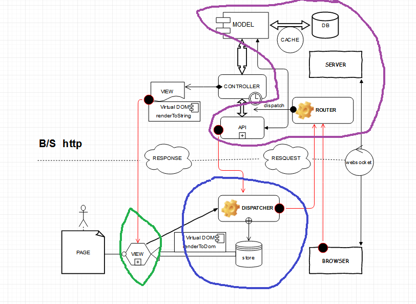
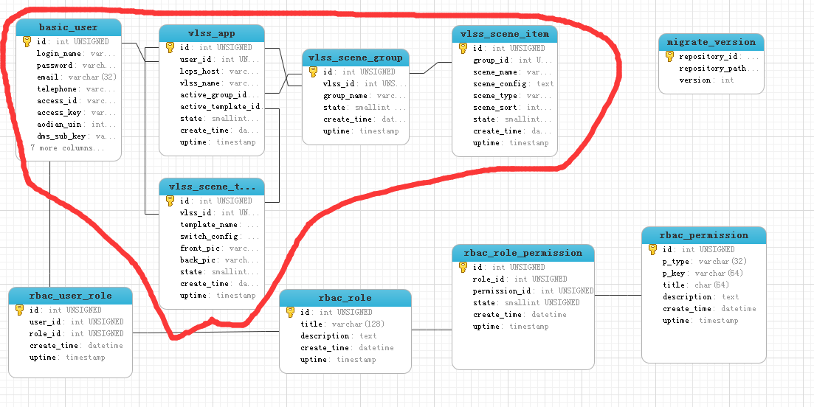

# 介绍

前端MVVM框架

## Vue.js 是什么

[官方文档](http://cn.vuejs.org/v2/guide/installation.html)

Vue.js（读音 /vjuː/, 类似于 view） 是一套构建用户界面的 渐进式框架。与其他重量级框架不同的是，Vue 采用自底向上增量开发的设计。

Vue 的核心库只关注视图层，并且非常容易学习，非常容易与其它库或已有项目整合。

另一方面，Vue 完全有能力驱动采用单文件组件和 Vue 生态系统支持的库开发的复杂单页应用。

Vue.js 的目标是通过尽可能简单的 API 实现响应的数据绑定和组合的视图组件(MVVM)。

## MVVM 是什么

`起源`：MVVM这个概念最是在2005年，由微软的工程师John Grossman在其博客中提出，最初用在微软的WPF上的。直到最近几年，MVVM这种设计才被Javascript所实现，并产生了许多框架。


`图示`： [MVC，MVP 和 MVVM 的图示 by 阮一峰](http://www.ruanyifeng.com/blog/2015/02/mvcmvp_mvvm.html)

`核心`：[Vue.js 数据绑定](http://v1-cn.vuejs.org/guide/#Hello-World)

`实现`：[Vue.js 深入响应式原理](http://cn.vuejs.org/v2/guide/reactivity.html)

## MV* 有哪些


[TodoMVC](http://todomvc.com/)

## 为什么是Vue

**非常容易与其它库或已有项目整合**

***

# 实现

制作4个页面：模版前景、模版背景、场景组预览、单个场景预览

`Model`: 紫色区域，实现数据存储及增删改查接口

`ViewModel`: 蓝色区域，实现从Model查询数据及修改数据

`View`: 绿色区域，实现页面显示



## Model 实现

编程语言：php5.4+、python2.7.*

### 数据表与数据填充
数据库：MySQL

数据表及字段名都是用小写字母加下划线格式



[模型描述 models.py](https://github.com/wowngasb/TinyWeb/blob/demo/migrate/app/models.py)

数据库迁移 [使用 SQLAlchemy-migrate 来跟踪数据库的更新](http://www.pythondoc.com/flask-mega-tutorial/database.html#id4)

[测试数据填充 db_seed.py](https://github.com/wowngasb/TinyWeb/blob/demo/migrate/db_seed.py)

``` shell
python db_create.py     //创建数据库
python db_migrate.py     //创建版本
python db_upgrade.py     //升级到最新版
python db_seed.py     //填充测试数据
```

### DAO及API实现

使用 `illuminate/database` Orm包，添加依赖

``` Javascript
{
  // ...
  "require": {
    "php": ">=5.4.0",
    "illuminate/database": "5.0.*"
  }
  // ...
}
```

``` shell
composer update     //更新依赖
```

[Orm实现](https://github.com/wowngasb/TinyWeb/tree/demo/app/api/OrmDao/Vlss)

[BaseOrm基类实现](https://github.com/wowngasb/TinyWeb/blob/demo/TinyWeb/Base/BaseOrm.php)

Json字段的处理
``` php
<?php

namespace app\api\OrmDao\Vlss;


use TinyWeb\Base\BaseOrm;

class SceneTemplate extends BaseOrm
{
    protected static $_tablename = 'vlss_scene_template';

    protected static function _fixItem($val)
    {
        if(!empty($val)) {
            $val['switch_config'] = !empty($val['switch_config']) ? json_decode($val['switch_config'], true) : [];
        }
        return $val;
    }
}
```


User表密码特殊处理

``` php
<?php

namespace app\api\OrmDao\Basic;

use TinyWeb\Base\BaseOrm;

class User  extends BaseOrm
{
    protected static $_tablename = 'basic_user';

    protected static function _fixItem($val)
    {
        if(!empty($val)){
            unset($val['password']);
        }
        return $val;
    }
}
```