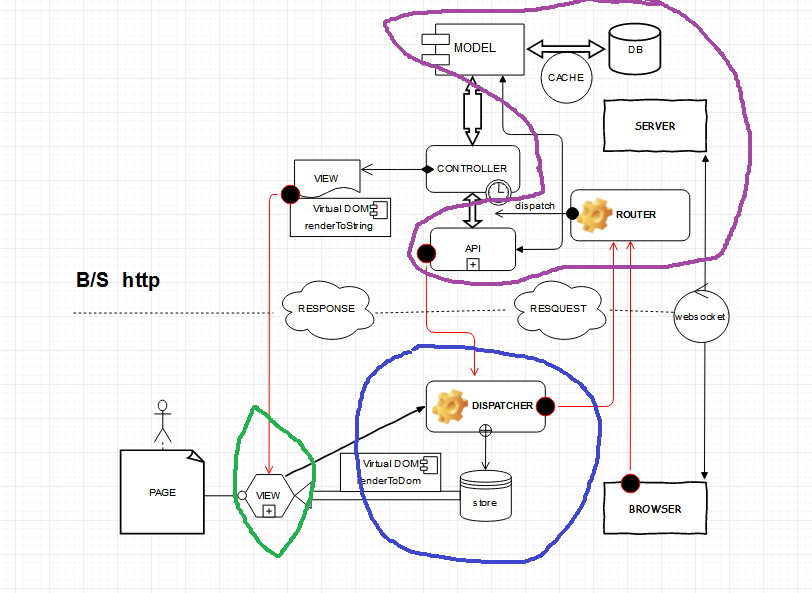
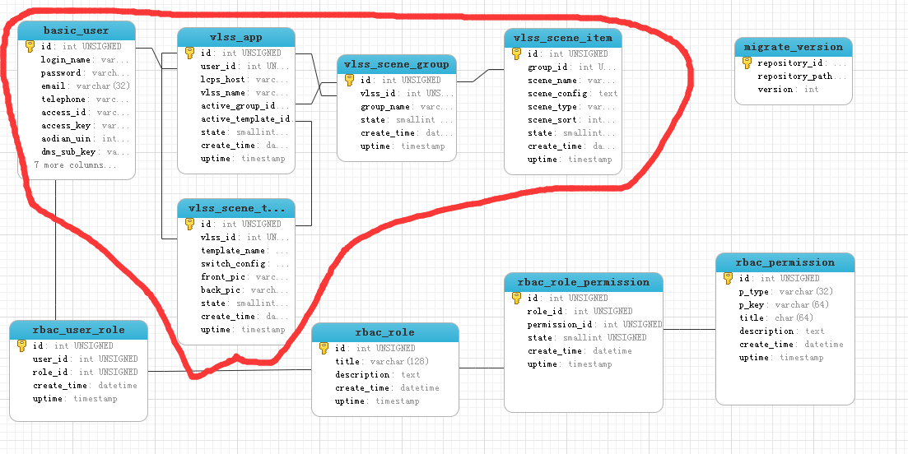

# 介绍

## Vue.js 是什么

Vue.js（读音 /vjuː/, 类似于 view） 是一套构建用户界面的 渐进式框架。与其他重量级框架不同的是，Vue 采用自底向上增量开发的设计。

Vue 的核心库只关注视图层，并且非常容易学习，非常容易与其它库或已有项目整合。

另一方面，Vue 完全有能力驱动采用单文件组件和 Vue 生态系统支持的库开发的复杂单页应用。

Vue.js 的目标是通过尽可能简单的 API 实现响应的数据绑定和组合的视图组件(MVVM)。

## MVVM 是什么

`起源`：MVVM这个概念最是在2005年，由微软的工程师John Grossman在其博客中提出，最初用在微软的WPF上的。直到最近几年，MVVM这种设计才被Javascript所实现，并产生了许多框架。


`图示`： [MVC，MVP 和 MVVM 的图示 by 阮一峰](http://www.ruanyifeng.com/blog/2015/02/mvcmvp_mvvm.html)

`核心`：[Vue.js 数据绑定](http://v1-cn.vuejs.org/guide/#Hello-World)

`实现`：[Vue.js 深入响应式原理](http://cn.vuejs.org/v2/guide/reactivity.html)

## MV* 有哪些


[TodoMVC](http://todomvc.com/)

## 为什么是Vue

**非常容易与其它库或已有项目整合**

***

# 实现

制作4个页面：模版前景、模版背景、场景组预览、单个场景预览

`Model`: 紫色区域，实现数据存储及增删改查接口

`ViewModel`: 蓝色区域，实现从Model查询数据及修改数据

`View`: 绿色区域，实现页面显示



## Model 实现

编程语言：php、python

数据库：MySQL

数据表及字段名都是用小写字母加下划线格式



模型表述

``` python

class BasicUser(Base):
    __tablename__ = 'basic_user'

    id = Column(Integer, primary_key=True)   #虚拟演播厅自增id
    login_name = Column(String(16), nullable=False, unique=True)   #用户管理后台登录名
    password = Column(String(32), nullable=False)   #用户管理后台登录名
    email = Column(String(32), nullable=False)   #用户邮箱
    telephone = Column(String(16), nullable=False)   #用户手机号
    access_id = Column(String(64), nullable=False)   #奥点云access_id
    access_key = Column(String(64), nullable=False)   #奥点云access_key
    aodian_uin = Column(Integer, nullable=False, index=True)   #奥点云 uin
    dms_sub_key = Column(String(64), nullable=False)   #DMS sub_key
    dms_pub_key = Column(String(64), nullable=False)   #DMS pub_key
    dms_s_key = Column(String(64), nullable=False)   #DMS s_key
    state = Column(SmallInteger, nullable=False, server_default=text("'0'"))   #1正常，2冻结，9删除
    last_login_ip = Column(String(32), nullable=False, server_default=text("''"))   #用户上次登录ip
    login_count = Column(Integer, nullable=False, server_default=text("'0'"))   #用户管理后台登录次数 登陆一次+1
    create_time = Column(DateTime, nullable=False)   #记录创建时间
    uptime = Column(TIMESTAMP, nullable=False, server_default=text("CURRENT_TIMESTAMP ON UPDATE CURRENT_TIMESTAMP"))   #更新时间


class VlssApp(Base):
    __tablename__ = 'vlss_app'

    id = Column(Integer, primary_key=True)   #虚拟演播厅自增id
    user_id = Column(ForeignKey(u'basic_user.id', ondelete=u'CASCADE', onupdate=u'CASCADE'), nullable=False, index=True)   #用户id
    lcps_host = Column(String(128), nullable=False, index=True)   #导播台域名  不带http://前缀 和 结尾/
    vlss_name = Column(String(16), nullable=False)   #演播厅名字
    active_group_id = Column(ForeignKey(u'vlss_scene_group.id', ondelete=u'SET NULL', onupdate=u'CASCADE'), index=True)   #激活的场景组id
    active_template_id = Column(ForeignKey(u'vlss_scene_template.id', ondelete=u'SET NULL', onupdate=u'CASCADE'), index=True)   #激活的场景模版id
    state = Column(SmallInteger, nullable=False, server_default=text("'0'"))   #1正常，2冻结，9删除
    create_time = Column(DateTime, nullable=False)   #记录创建时间
    uptime = Column(TIMESTAMP, nullable=False, server_default=text("CURRENT_TIMESTAMP ON UPDATE CURRENT_TIMESTAMP"))   #更新时间

    active_group = relationship(u'VlssSceneGroup', primaryjoin='VlssApp.active_group_id == VlssSceneGroup.id')
    active_template = relationship(u'VlssSceneTemplate', primaryjoin='VlssApp.active_template_id == VlssSceneTemplate.id')
    user = relationship(u'BasicUser')


class VlssSceneGroup(Base):
    __tablename__ = 'vlss_scene_group'

    id = Column(Integer, primary_key=True)
    vlss_id = Column(ForeignKey(u'vlss_app.id', ondelete=u'CASCADE', onupdate=u'CASCADE'), nullable=False, index=True)   #虚拟演播厅id
    group_name = Column(String(32), nullable=False)   #场景组名称
    state = Column(SmallInteger, nullable=False, server_default=text("'0'"))   #1正常,9删除
    create_time = Column(DateTime, nullable=False)   #记录创建时间
    uptime = Column(TIMESTAMP, nullable=False, server_default=text("CURRENT_TIMESTAMP ON UPDATE CURRENT_TIMESTAMP"))   #更新时间

    vlss = relationship(u'VlssApp', primaryjoin='VlssSceneGroup.vlss_id == VlssApp.id')


class VlssSceneItem(Base):
    __tablename__ = 'vlss_scene_item'

    id = Column(Integer, primary_key=True)
    group_id = Column(ForeignKey(u'vlss_scene_group.id', ondelete=u'CASCADE', onupdate=u'CASCADE'), nullable=False, index=True, server_default=text("'0'"))   #所属场景组id
    scene_name = Column(String(32), nullable=False)   #场景名称
    scene_config = Column(Text, nullable=False)   #场景配置 格式为 json 字符串
    scene_type = Column(String(16), nullable=False, server_default=text("''"))   #场景类型
    scene_sort = Column(Integer, nullable=False, server_default=text("'10'"))   #场景叠加排序
    state = Column(SmallInteger, nullable=False, server_default=text("'0'"))   #1正常,2隐藏,9删除
    create_time = Column(DateTime, nullable=False)   #记录创建时间
    uptime = Column(TIMESTAMP, nullable=False, server_default=text("CURRENT_TIMESTAMP ON UPDATE CURRENT_TIMESTAMP"))   #更新时间

    group = relationship(u'VlssSceneGroup')


class VlssSceneTemplate(Base):
    __tablename__ = 'vlss_scene_template'

    id = Column(Integer, primary_key=True)
    vlss_id = Column(ForeignKey(u'vlss_app.id', ondelete=u'CASCADE', onupdate=u'CASCADE'), nullable=False, index=True)   #虚拟演播厅id
    template_name = Column(String(16), nullable=False)   #模板名称
    switch_config = Column(Text, nullable=False)   #模版配置 格式为 json 字符串
    front_pic = Column(String(255), nullable=False)
    back_pic = Column(String(255), nullable=False)
    state = Column(SmallInteger, nullable=False, server_default=text("'0'"))   #1正常,9删除
    create_time = Column(DateTime, nullable=False)   #记录创建时间
    uptime = Column(TIMESTAMP, nullable=False, server_default=text("CURRENT_TIMESTAMP ON UPDATE CURRENT_TIMESTAMP"))   #更新时间

    vlss = relationship(u'VlssApp', primaryjoin='VlssSceneTemplate.vlss_id == VlssApp.id')

```

数据库迁移 [使用 SQLAlchemy-migrate 来跟踪数据库的更新](http://www.pythondoc.com/flask-mega-tutorial/database.html#id4)

``` shell
python db_create.py
python db_migrate.py
python db_upgrade.py
```